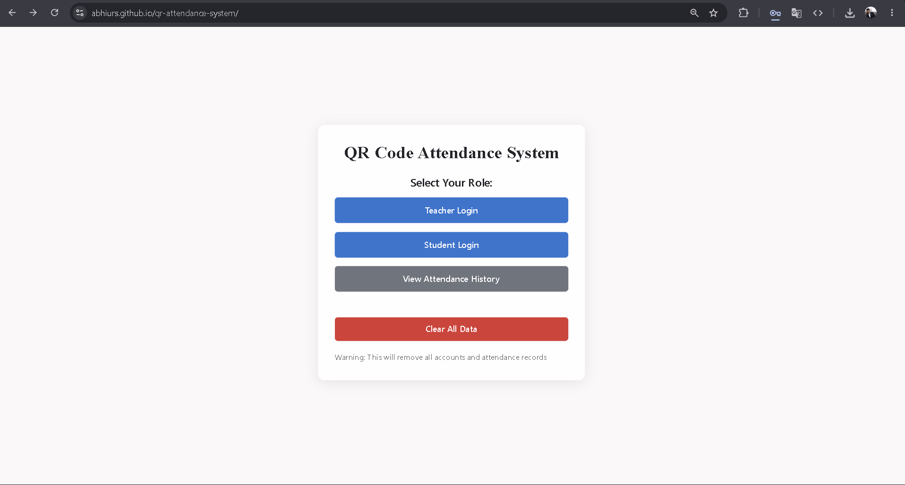
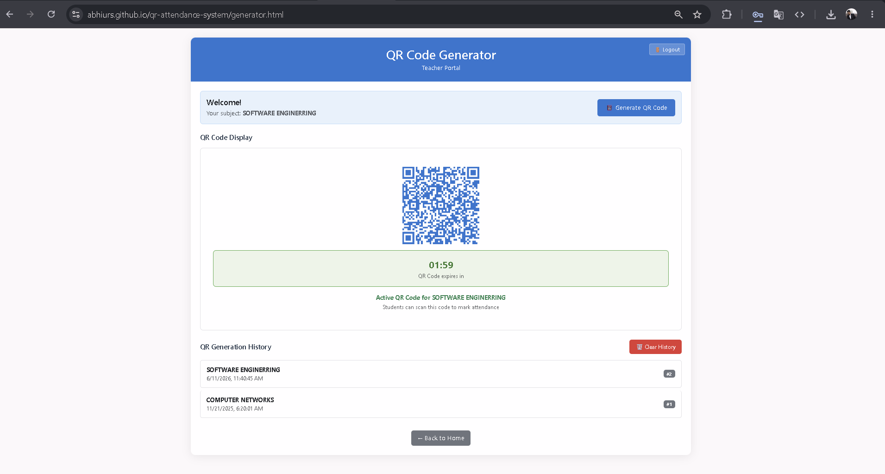
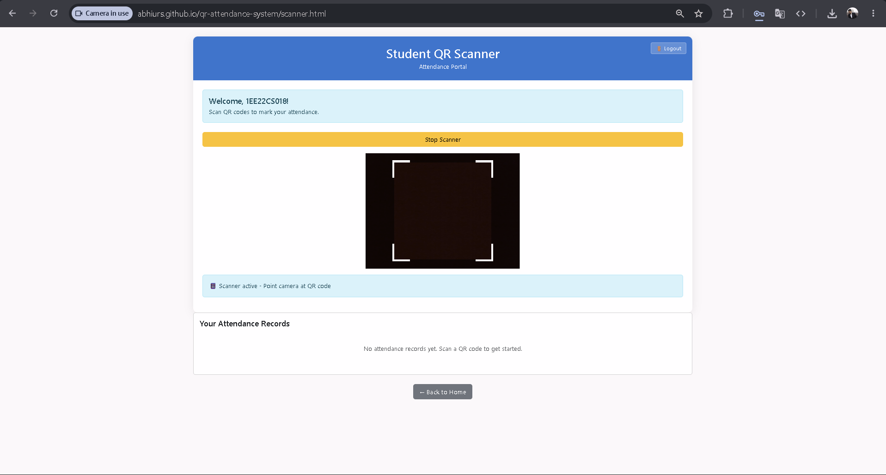
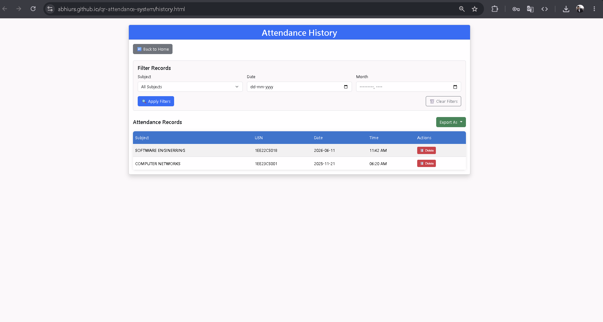

# QR Attendance System

A modern web-based QR Attendance Management System designed to simplify and automate attendance tracking for educational institutions. The system enables teachers to generate attendance QR codes and students to scan them for secure and efficient attendance marking.

This project focuses on improving attendance management through automation, QR technology, and user-friendly interfaces while reducing manual work and proxy attendance issues.

---

# Project Overview

Traditional attendance systems are often time-consuming and prone to errors or proxy attendance. This project provides a smart digital solution where attendance can be marked instantly using QR codes.

The application includes separate portals for students and teachers, QR generation and scanning functionality, attendance history tracking, and QR expiration validation for improved security and attendance accuracy.

---

# Key Features

## Teacher Module

* Teacher Registration & Login
* Generate QR Codes for Attendance
* Manage Attendance Sessions
* View Attendance History

## Student Module

* Student Registration & Login
* Scan QR Codes
* Mark Attendance Digitally
* Access Attendance Records

## QR Attendance System

* QR Code Generation
* QR Code Scanning Functionality
* QR Expiry Validation
* Automated Attendance Recording

## User Interface

* Responsive Design
* Clean Dashboard Interface
* Mobile-Friendly Layout
* Easy Navigation System

---

# Technologies Used

## Frontend

* HTML5
* CSS3
* JavaScript

## QR Technologies

* QR Code Generator Libraries
* QR Code Scanner Libraries

## Development Tools

* Visual Studio Code
* Git
* GitHub

---

# Project Structure

```bash
qr-attendance-system/
│
├── .github/
│
├── screenshots/
│
├── index.html                  # Main Landing Page
│
├── generator.html              # QR Generator Interface
├── generator.js                # QR Generation Logic
│
├── scanner.html                # QR Scanner Interface
├── scanner.js                  # QR Scanner Logic
│
├── history.html                # Attendance History Page
├── history.js                  # Attendance History Logic
│
├── student-login.html          # Student Login Page
├── student-register.html       # Student Registration Page
│
├── teacher-login.html          # Teacher Login Page
├── teacher-register.html       # Teacher Registration Page
│
├── qrcode-expiry.js            # QR Expiry Validation Logic
│
├── script.js                   # Main Application Script
├── style.css                   # Main Stylesheet
│
└── README.md
```

---

# How the System Works

## Teacher Workflow

1. Teacher logs into the system.
2. Teacher generates a QR code for attendance.
3. QR code becomes available for students.

## Student Workflow

1. Student logs into the system.
2. Student scans the QR code.
3. Attendance gets recorded automatically.

## Attendance Workflow

1. Attendance data is processed.
2. QR expiry validation is checked.
3. Attendance history is stored and displayed.

---

# Security Features

* QR Expiry Validation
* Input Validation
* Separate Authentication Systems
* Secure Attendance Workflow
* Prevention of Invalid Attendance Submission

---

# Installation & Setup

## Clone the Repository

```bash
git clone https://github.com/abhiurs/qr-attendance-system.git
```

## Navigate to the Project Directory

```bash
cd qr-attendance-system
```

## Open in Visual Studio Code

```bash
code .
```

## Run the Project

Open:

```bash
index.html
```

in your browser.

OR

Use the VS Code Live Server Extension.

---

# Running with Live Server

## Step 1

Install the **Live Server** extension in VS Code.

## Step 2

Right-click:

```bash
index.html
```

## Step 3

Click:

```bash
Open with Live Server
```

---

# Screenshots

## Home Page



---

## QR Generator Page



---

## QR Scanner Page



---

## Attendance History Page



---

# Future Improvements

* Database Integration
* Dynamic QR Codes
* Admin Dashboard
* Attendance Analytics
* Face Recognition Attendance
* Export Attendance Reports
* Mobile Application Version
* Cloud Deployment

---

# Author

## Abhi Urs

Computer Science Engineering Student

GitHub:
https://github.com/abhiurs

---

# License

This project is created for educational, learning, and portfolio purposes.
